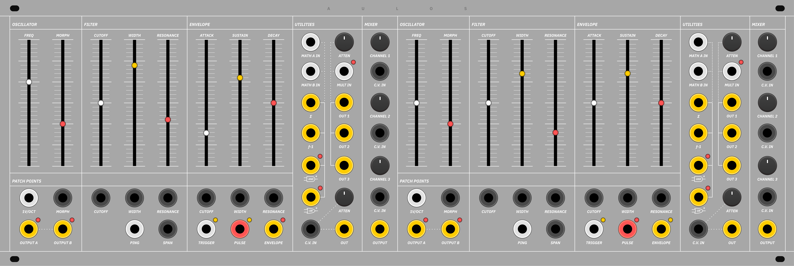

# Aulos


## Demo

Please click the thumbnail below to be directed to the video demonstration of the current firmware: 

[](https://www.youtube.com/watch?v=ZTuEySEleiw?si=39wRLsX7yXqIgUet)  

## Overview

This repository contains the firmware and source code for a modern recreation of the Trautonium, an early electronic musical instrument known for its expressive control and subharmonic character. The project is named _Aulos_ after the ancient Greek double-piped wind instrument, celebrated for its rich, expressive tones and cultural significance in early music. This name reflects the project's aim to recreate an instrument with similar expressive capabilities. The firmware, written in C++, is designed for the DaisyDSP microcontroller and Arduino platforms. The .bin file is a precompiled firmware binary ready for flashing onto a supported device.

## Dependencies

- **[libDaisy](https://github.com/electro-smith/libDaisy)** – Daisy hardware abstraction library.  
- **[DaisySP](https://github.com/electro-smith/DaisySP)** – DSP library for the Daisy platform.  
- **[arm-none-eabi-gcc](https://developer.arm.com/tools-and-software/open-source-software/developer-tools/gnu-toolchain/gnu-rm)** (or equivalent) for compiling.  

Depending on your workflow, you can either use the **Daisy toolchain** (CMake-based) or a **PlatformIO** environment configured for Daisy development.

## Building and Flashing

1. **Clone the repository** (or download the source):
```bash
   git clone https://github.com/yourusername/aulos.git
   cd aulos
```
2. Ensure the Daisy toolchain is installed and properly set up:
    
    a. Install DaisyDuino/Make/CMake environment.
    
    b. Build the firmware:
    
    c. If using the Make-based environment:

```bash
make
```

    d. Or, if using CMake:

```bash
mkdir build
cd build
cmake ..
make
```

3. Flash the binary to the Daisy Patch:

    a. Connect your Daisy Patch via USB in DFU mode.
    b. Run:

```bash
make program-dfu
```

    c. or use the relevant CMake/PlatformIO target.
    d. After flashing completes, reboot the Daisy Patch. Aulos will automatically run.

## Usage

Once installed, the Aulos firmware boots immediately into audio generation mode. The subharmonic oscillators are layered over two main oscillators.

## License
This project is licensed under the MIT License. You are free to use, modify, and distribute this software in accordance with the terms of the MIT License. See the LICENSE file for more details.